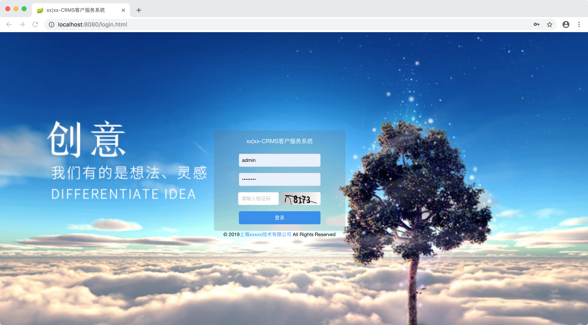
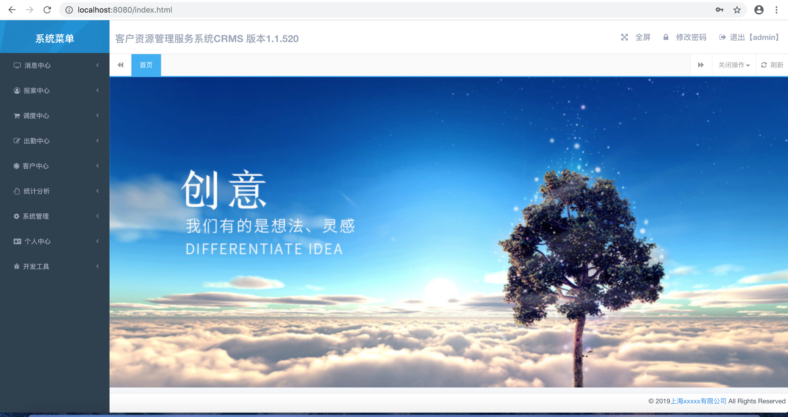
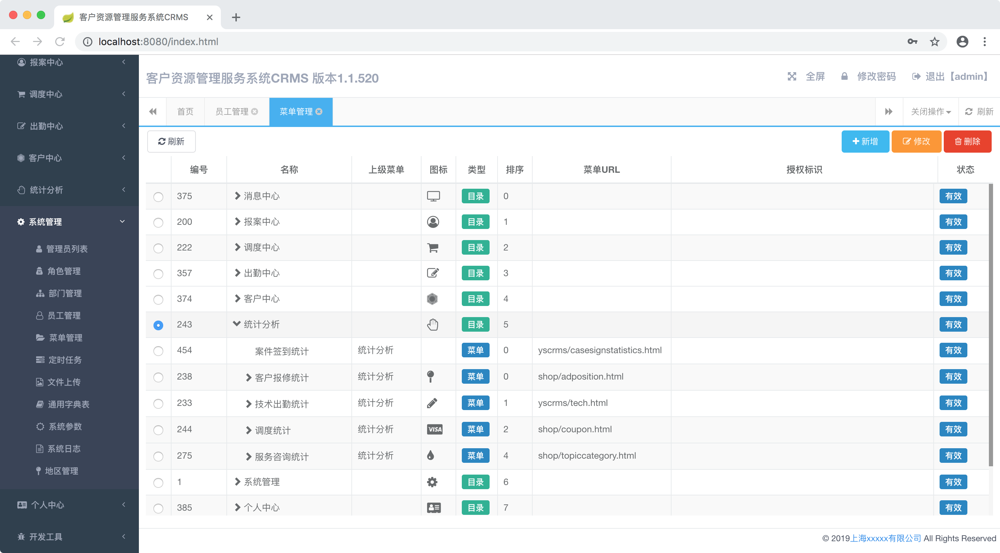
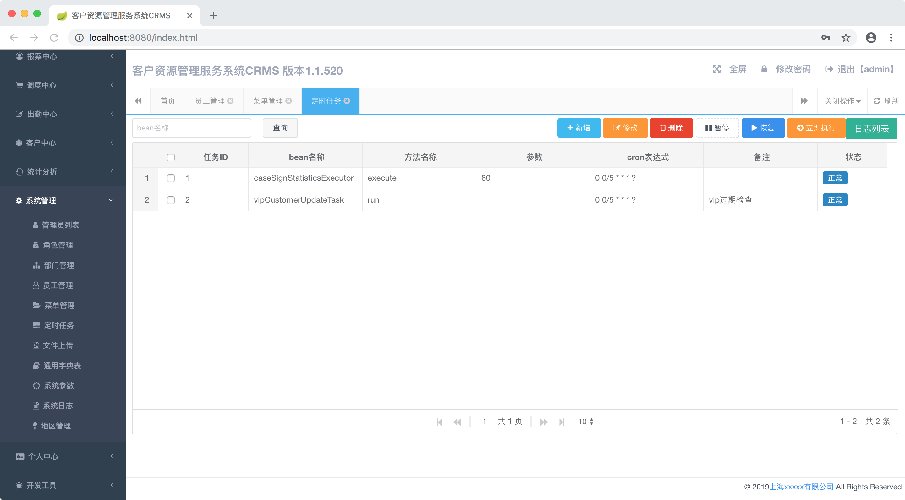
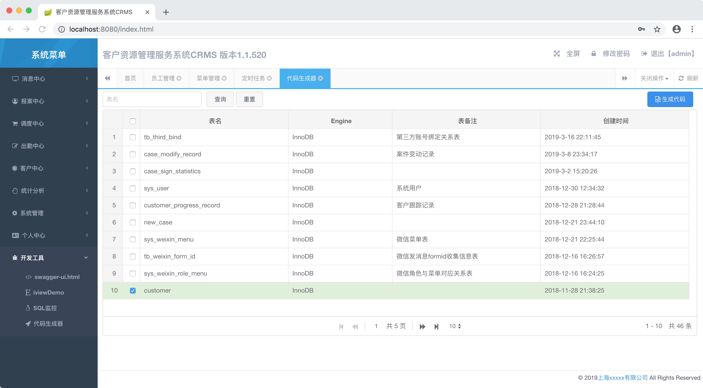

## spring boot demo 项目
    适合于快速搭建后台管理系统。项目基于spring boot2.x搭建
    包括功能：权限控制（基于shiro：菜单权限、按钮权限）、quartz定时任务（在线创建，暂停，恢复等无需重启）、
    自动生成代码、菜单管理、用户管理、角色管理、地区管理等

### 1.项目使用框架
    spring boot2.x
    spring mvc 
    mybatis
    shiro
    thymeleaf
    quartz           
    
    vue.js
    iview
    
    redis
    mysql
    
### 2.项目启动
    数据库依赖: 执行sql脚本创建数据库结构,项目根目录 dump-ys-crms-201903171348.sql
    redis： 修改redis连接信息
    spring boot启动类：com.luno.softone.DemoApplication
    
    

### 3.运行效果截图
   #### 登录页
    后台shiro验证，用redis保存session，支持多节点session共享
   
   #### 首页
    首页，展示版本号，每次重启版本自动增1
   
   #### 菜单管理
    菜单管理，新增页面
   
   #### 定时任务
    quartz定时任务，支持添加、暂停、立即执行等，实时生效
   
   #### 代码生成 
    代码生成模版，支持根据表结构生成Java代码、html、js代码
   